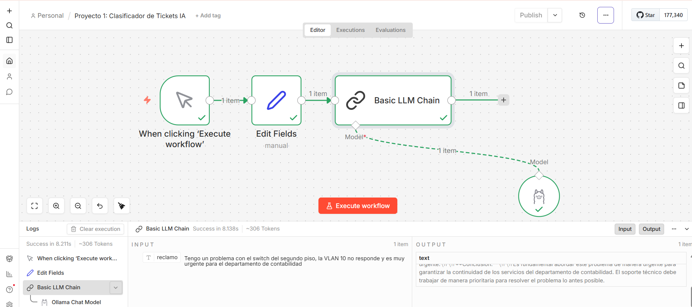

# 🤖 AI Network Agent: Clasificador Automático de Incidencias

Este proyecto es una solución de **Automatización de IT** que utiliza Inteligencia Artificial para procesar, analizar y clasificar tickets de soporte técnico de redes de forma autónoma.

## 🚀 Visión General
El sistema recibe un reclamo técnico (ej: problemas de VLAN, conectividad o switches), lo procesa mediante un modelo de lenguaje de gran escala (LLM) y devuelve una clasificación estructurada con nivel de urgencia, departamento responsable y un resumen ejecutivo.

## 🛠️ Stack Tecnológico
- **Orquestación:** [n8n](https://n8n.io/) (Flujos de trabajo basados en nodos).
- **IA Local:** [Ollama](https://ollama.com/) (Motor de ejecución de modelos).
- **Modelo LLM:** **Llama 3.2** (Optimizado para razonamiento y clasificación).
- **Lógica de Datos:** Expresiones en JSON y Prompt Engineering.

## 💡 Por qué esta arquitectura es superior (Business Value)
1. **Privacidad de Datos (Privacy First):** Al ejecutar el modelo localmente con Ollama, los datos sensibles de la infraestructura de red nunca salen de la organización.
2. **Coste Operativo Cero:** A diferencia de soluciones basadas en OpenAI o Claude, este sistema no tiene costes por token o ejecución.
3. **Escalabilidad:** El flujo es fácilmente integrable con APIs de terceros como Telegram, Slack o bases de datos SQL/NoSQL.

## 📋 Ejemplo de Procesamiento
- **Input (Ticket):** *"La VLAN 10 del segundo piso no responde, el departamento de contabilidad está parado."*
- **Output de la IA:**
  - **Urgencia:** Alta
  - **Departamento:** Redes / Infraestructura
  - **Acción Sugerida:** Revisar configuración de VLAN 10 y estado del switch del piso 2.

## 📸 Captura del Proyecto

## 🔧 Instalación y Uso
1. Instalar **Ollama** y ejecutar `ollama pull llama3.2`.
2. Instalar **n8n** localmente vía npm (`npx n8n`) o Docker.
3. Importar el archivo `workflow.json` incluido en este repositorio.
4. Asegurarse de que la credencial de Ollama apunta a `http://localhost:11434`.

---
**Desarrollado por Víctor Chaves** *Enfocado en la intersección entre Redes, Automatización e Inteligencia Artificial.*
